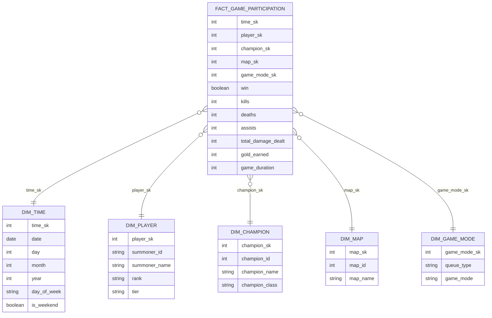

## Analyse de Statistiques League of Legends (Projet ELT)

Equipe  
Rémi TRAN SAMMARCELLI 
Mathieu VERMENOUZE
Théo TARDIVON

## Jeu de Données 
Source : Dataset League of Legends (CSV)  
Contenu : Plusieurs milliers de parties League of Legends.  
Caractéristiques :  
- Informations de parties (mode, durée, version)  
- Joueurs (puuid, pseudo, niveau)  
- Champions joués  
- Statistiques détaillées par participant  
- Classements SoloQ et Flex  

## Architecture Technique

Composant        | Technologie                  | Rôle
-----------------|------------------------------|---------------------------------------------
Extract / Load   | PostgreSQL 15                | Stockage des données RAW et transformées
Transformation  | Python (Pandas, SQLAlchemy)  | Nettoyage, typage et normalisation
Visualisation   | Metabase                     | Analyse et dashboards
Orchestration   | Docker Compose               | Conteneurisation de l’infrastructure

Installation et Lancement

### 1. Prérequis  
Docker Desktop et Python 3.10+  

Placer le fichier CSV dans le dossier `./data/`

### 2. Démarrage de l’infrastructure

docker compose up -d

### 3. Exécution de l’ETL  
Ouvrir et exécuter le notebook ETL.ipynb.
Celui-ci automatise l’importation des données (RAW), la transformation relationnelle et la création du Data Mart.

### 4. Modèle relationnel
Le modèle relationnel permet d’organiser les données League of Legends de manière normalisée et cohérente.

La table games contient les informations générales des parties.
La table summoners stocke les données des joueurs, tandis que champions référence les champions joués.

La table participants fait le lien entre une partie, un joueur et un champion, et décrit le contexte de jeu (rôle, équipe, victoire).
Les statistiques détaillées par joueur et par partie sont stockées dans participant_stats.

Enfin, la table ranks conserve les informations de classement des joueurs en SoloQ et Flex.

Ce modèle sert de base à la création du Data Mart et aux analyses ultérieures.


## Table de faits
```fact_game_participation ```
Cette table représente la performance d’un joueur dans une partie.
Granularité :1 ligne = 1 joueur dans 1 partie.

Mesures principales :
```
win  
kills  
deaths  
assists  
total_damage_dealt  
gold_earned  
game_duration
```

Cette structure permet de calculer des indicateurs tels que le taux de victoire, le KDA moyen ou la durée moyenne des parties.

## Dimensions
Le modèle comporte cinq dimensions :
```
dim_time : analyse temporelle (jour, mois, année, week-end)
dim_player : informations sur le joueur (identité, rang, tier)
dim_champion : caractéristiques du champion (nom, classe)
dim_map : carte jouée
dim_game_mode : type et mode de jeu
```
Ces dimensions permettent d’analyser les performances selon différents axes métier.

# Exemple de question métier
Ce modèle permet de répondre à des questions telles que :

Quel est le taux de victoire par classe de champion sur une carte donnée durant le week-end ?

La table de faits fournit la mesure win, tandis que les dimensions permettent la segmentation par temps, champion et carte.



## Architecture Technique

| Composant | Technologie | Rôle |
|-----------|-------------|------|
| **Extract / Load** | PostgreSQL 15 | Stockage des données RAW et transformées |
| **Transformation** | Python (Pandas, SQLAlchemy) | Nettoyage, typage et normalisation |
| **Visualisation** | Metabase | Analyse et dashboards |
| **Orchestration** | Docker Compose | Conteneurisation de l'infrastructure |
| **Logs** | Dozzle | Centralisation et visualisation des logs |

---

## Prérequis d'Installation

### Logiciels Requis

1. **Docker Desktop** (version 20.10 ou supérieure)
   - Windows : [Télécharger Docker Desktop](https://www.docker.com/products/docker-desktop)
   - Mac : [Télécharger Docker Desktop](https://www.docker.com/products/docker-desktop)
   - Linux : Installer Docker Engine et Docker Compose
   ```bash
   # Ubuntu/Debian
   sudo apt-get update
   sudo apt-get install docker.io docker-compose
   ```

2. **Python 3.10+** (pour l'exécution du notebook ETL)
   - Vérifier la version : `python --version`
   - [Télécharger Python](https://www.python.org/downloads/)

3. **Git** (optionnel, pour cloner le repository)
   ```bash
   git clone https://github.com/Ubiiko/atelier1-datamart-lol.git
   cd atelier1-datamart-lol
   ```

### Configuration Système Minimale

- **RAM :** 8 GB minimum (16 GB recommandé)
- **Espace disque :** 10 GB disponibles
- **CPU :** 4 cœurs recommandés
- **OS :** Windows 10/11, macOS 10.15+, Linux (Ubuntu 20.04+)

---

## Procédure de Lancement Complet de la Stack

### Étape 1 : Préparation des Données

1. **Placer le fichier CSV** dans le dossier `./data/`
   ```
   atelier1-datamart-lol/
   ├── data/
   │   └── lol_dataset.csv  ← Votre fichier ici
   ├── docker-compose.yml
   └── ...
   ```

### Étape 2 : Démarrage de l'Infrastructure Docker

```bash
# Se placer dans le répertoire du projet
cd atelier1-datamart-lol

# Démarrer tous les services
docker compose up -d

# Vérifier que tous les conteneurs sont actifs
docker compose ps
```

**Résultat attendu :**
```
NAME              IMAGE                           STATUS
lol_dozzle        amir20/dozzle:latest           Up
lol_jupyter       jupyter/scipy-notebook:latest  Up
lol_metabase      metabase/metabase:latest       Up
lol_postgres      postgres:15                    Up (healthy)
```

### Étape 3 : Vérification des Services

Vérifier l'accès aux différentes interfaces :

| Service | URL | Accès |
|---------|-----|-------|
| **Jupyter Notebook** | http://localhost:8888 | ETL et transformation |
| **Metabase** | http://localhost:3000 | Dashboards BI |
| **Dozzle** | http://localhost:8080 | Logs centralisés |
| **PostgreSQL** | localhost:5432 | Base de données |

### Étape 4 : Configuration Initiale de Metabase

1. Accéder à http://localhost:3000
2. Créer un compte administrateur
3. Configurer la connexion à PostgreSQL :
   - **Type :** PostgreSQL
   - **Nom :** LOL Datamart
   - **Hôte :** postgres
   - **Port :** 5432
   - **Database :** lol_datamart
   - **Utilisateur :** lol_user
   - **Mot de passe :** lol_password

### Étape 5 : Exécution de l'ETL

1. Ouvrir Jupyter Notebook : http://localhost:8888
2. Naviguer vers `work/etl.ipynb`
3. Exécuter toutes les cellules du notebook
4. Vérifier que toutes les tables sont créées dans PostgreSQL

**Ordre d'exécution :**
- Import des données RAW
- Nettoyage et transformation
- Création du modèle relationnel
- Création du Data Mart (schéma en étoile)

---

## Valeurs Configurables

### Configuration Docker Compose

#### Variables d'environnement PostgreSQL
```yaml
environment:
  POSTGRES_USER: lol_user          # Nom d'utilisateur de la DB
  POSTGRES_PASSWORD: lol_password  # Mot de passe de la DB
  POSTGRES_DB: lol_datamart        # Nom de la base de données
```

#### Ports exposés (modifiables)
```yaml
ports:
  - "5432:5432"   # PostgreSQL
  - "3000:3000"   # Metabase
  - "8888:8888"   # Jupyter
  - "8080:8080"   # Dozzle
```

**Important :** Si vous modifiez les ports, pensez à mettre à jour :
- Les URLs d'accès aux services
- Les chaînes de connexion dans le code ETL
- La configuration Metabase

#### Configuration des Logs
```yaml
logging:
  driver: json-file
  options:
    max-size: "10m"   # Taille max par fichier de log
    max-file: "3"     # Nombre de fichiers à conserver
    labels: "service=postgres"  # Labels pour filtrage
```

---

## Points de Vigilance pour l'Ajout de Services

### 1. Réseau Docker

**Tous les nouveaux services doivent être sur le réseau `lol_network`** :

```yaml
services:
  nouveau_service:
    image: mon_image
    networks:
      - lol_network
    # ...

networks:
  lol_network:
    driver: bridge
```

### 2. Dépendances entre Services

Utiliser `depends_on` avec conditions de santé pour garantir l'ordre de démarrage :

```yaml
services:
  nouveau_service:
    depends_on:
      postgres:
        condition: service_healthy
```

### 3. Configuration des Logs

**OBLIGATOIRE** pour que Dozzle capture les logs :

```yaml
logging:
  driver: json-file
  options:
    max-size: "10m"
    max-file: "3"
    labels: "service=nouveau_service"
```

### 4. Nommage des Conteneurs

Respecter la convention de nommage pour le filtre Dozzle :

```yaml
container_name: lol_nouveau_service  # Préfixe 'lol_' obligatoire
```

### 5. Health Checks

Ajouter des health checks pour les services critiques :

```yaml
healthcheck:
  test: ["CMD", "curl", "-f", "http://localhost:port/health"]
  interval: 30s
  timeout: 10s
  retries: 3
  start_period: 40s
```

### 6. Volumes Persistants

Pour les données à persister :

```yaml
volumes:
  - nom_volume:/chemin/dans/conteneur

volumes:
  nom_volume:
    driver: local
```

### 7. Sécurité

- **NE JAMAIS** commiter de mots de passe en clair
- Utiliser un fichier `.env` pour les secrets :

```bash
# .env
POSTGRES_PASSWORD=mon_mot_de_passe_securise
METABASE_SECRET_KEY=cle_secrete_aleatoire
```

```yaml
environment:
  POSTGRES_PASSWORD: ${POSTGRES_PASSWORD}
```

---

## Étape 3 : Centralisation des Logs avec Dozzle

### Présentation de Dozzle

**Dozzle** est une interface web légère pour visualiser les logs Docker en temps réel.

**Avantages :**
- Zéro configuration
- Interface moderne et réactive
- Recherche et filtrage en temps réel
- Pas de base de données externe requise
- Lecture seule (sécurité)

### Configuration

Le service Dozzle est configuré dans `docker-compose.yml` :

```yaml
dozzle:
  image: amir20/dozzle:latest
  container_name: lol_dozzle
  ports:
    - "8080:8080"
  volumes:
    - /var/run/docker.sock:/var/run/docker.sock:ro
  environment:
    DOZZLE_LEVEL: info
    DOZZLE_TAILSIZE: 300
    DOZZLE_FILTER: "name=lol_*"
  networks:
    - lol_network
  logging:
    driver: json-file
    options:
      max-size: "5m"
      max-file: "2"
```

### Accès à l'Interface

**URL :** http://localhost:8080

**Fonctionnalités :**
- Vue multi-conteneurs
- Recherche dans les logs
- Téléchargement des logs
- Affichage en temps réel
- Filtrage par niveau (info, warning, error)

### Filtres Configurés

Les logs sont filtrés pour n'afficher que les conteneurs du projet :
- `lol_postgres` - Logs de la base de données
- `lol_metabase` - Logs de Metabase
- `lol_jupyter` - Logs de Jupyter Notebook

---

## Reproduction d'une Erreur Type via Dozzle

### Scénario : Échec de Connexion à la Base de Données

#### 1. Provoquer l'Erreur

**Méthode 1 : Arrêter PostgreSQL**
```bash
docker compose stop postgres
```

**Méthode 2 : Modifier les Credentials**
```yaml
# Dans docker-compose.yml, modifier temporairement :
metabase:
  environment:
    MB_DB_PASS: mauvais_mot_de_passe  # Mot de passe incorrect
```

```bash
docker compose up -d metabase
```

#### 2. Visualiser l'Erreur dans Dozzle

1. Accéder à http://localhost:8080
2. Sélectionner le conteneur `lol_metabase`
3. Observer les logs d'erreur

**Exemple de log pour une authentification réussi sur MetaBase:**


**Exemple de log d'erreur pour un mauvais mot de passe :**


#### 3. Capturer les Logs pour Documentation

**Dans Dozzle :**
1. Rechercher "ERROR" ou "password authentication"
2. Copier les logs pertinents
3. Screenshot de l'interface

**Via CLI :**
```bash
# Exporter les logs du conteneur
docker logs lol_metabase > metabase_error_logs.txt

# Filtrer uniquement les erreurs
docker logs lol_metabase 2>&1 | grep -i error > metabase_errors.txt
```

#### 4. Résoudre l'Erreur

**Si PostgreSQL était arrêté :**
```bash
docker compose start postgres
# Attendre 10-15 secondes pour le health check
docker compose restart metabase
```

**Si credentials incorrects :**
```bash
# Restaurer les bonnes valeurs dans docker-compose.yml
docker compose up -d metabase
```

#### 5. Vérifier la Résolution

Dans Dozzle, observer les nouveaux logs :

```
2026-02-12 12:35:30 INFO metabase.core :: 
Successfully connected to database: lol_datamart

2026-02-12 12:35:31 INFO metabase.core :: 
Metabase Initialization COMPLETE
```

---

## Structure du Projet

```
atelier1-datamart-lol/
├── data/
│   └── lol_dataset.csv              # Dataset source
├── docker-compose.yml               # Configuration des conteneurs (avec Dozzle)
├── etl.ipynb                        # Notebook ETL
├── requirements.txt                 # Dépendances Python
└── readme.md                        # Documentation
```

---

## Commandes Utiles

### Gestion des Conteneurs

```bash
# Démarrer la stack
docker compose up -d

# Arrêter la stack
docker compose down

# Redémarrer un service spécifique
docker compose restart postgres

# Voir les logs d'un service
docker compose logs -f metabase

# Voir l'état des services
docker compose ps

# Arrêter et supprimer tout (ATTENTION : perte de données)
docker compose down -v
```

### Accès à PostgreSQL

```bash
# Via ligne de commande
docker exec -it lol_postgres psql -U lol_user -d lol_datamart

# Requête rapide
docker exec -it lol_postgres psql -U lol_user -d lol_datamart -c "SELECT COUNT(*) FROM games;"
```

### Backup et Restore

```bash
# Backup de la base de données
docker exec lol_postgres pg_dump -U lol_user lol_datamart > backup_$(date +%Y%m%d).sql

# Restore
docker exec -i lol_postgres psql -U lol_user lol_datamart < backup_20260212.sql
```

---

## Troubleshooting

### Problème 1 : Les conteneurs ne démarrent pas

**Symptôme :** `docker compose up -d` échoue

**Solutions :**
```bash
# Vérifier les logs
docker compose logs

# Vérifier l'espace disque
df -h

# Vérifier que Docker est en cours d'exécution
docker info

# Nettoyer les ressources inutilisées
docker system prune -a
```

### Problème 2 : Metabase ne se connecte pas à PostgreSQL

**Solutions :**
1. Vérifier que PostgreSQL est "healthy" : `docker compose ps`
2. Tester la connexion manuellement :
   ```bash
   docker exec -it lol_postgres psql -U lol_user -d lol_datamart
   ```
3. Vérifier les credentials dans docker-compose.yml

### Problème 3 : Jupyter ne trouve pas les librairies

**Solution :**
```bash
# Réinstaller les dépendances
docker exec -it lol_jupyter pip install -r /tmp/requirements.txt
```

### Problème 4 : Dozzle n'affiche aucun log

**Solutions :**
1. Vérifier que le conteneur a le bon label :
   ```bash
   docker inspect lol_postgres | grep -i label
   ```
2. Vérifier le filtre dans docker-compose.yml
3. Redémarrer Dozzle :
   ```bash
   docker compose restart dozzle
   ```

---

## Ressources

- [Documentation Docker Compose](https://docs.docker.com/compose/)
- [Documentation PostgreSQL](https://www.postgresql.org/docs/)
- [Documentation Metabase](https://www.metabase.com/docs/)
- [Documentation Dozzle](https://dozzle.dev/)
- [Guide Pandas](https://pandas.pydata.org/docs/)
